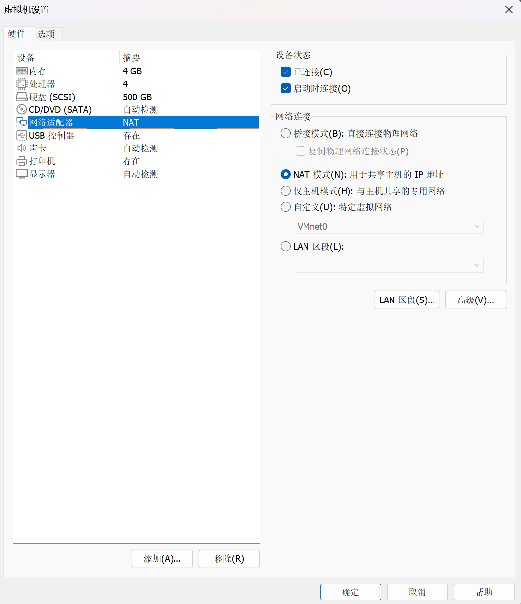

## 1、基本命令

### 【P5】2_3_shell命令解析与PATH环境变量

```shell
# 进行磁盘操作
fdisk /dev/sda
# 退出磁盘操作
q

# 输出环境变量路径
echo $PATH
# 输出所有的环境变量
env

cd /home/book/Desktop
gcc -o hello hello.c
# 需要使用相对路径或绝对路径。不带路径的话，默认会从$PATH路径下找
hello # Command 'hello' not found...
./hello # Hello, world!
./hello vectorx # Hello, vectorx!
/home/book/Desktop/hello test #Hello, test!
# 不想带路径，可以随意移动到一个环境变量所在的路径下
sudo cp hello /usr/local/bin/hello2
hello2 # Hello, world!

# 1、临时设置环境变量
cp hello /home/book
export PATH=$PATH:/home/book
hello # Hello, world!

# 2、永久设置环境变量（对当前用户有效）
gedit ~/.bashrc
# 页尾添加
export PATH=$PATH:/home/book
hello # Hello, world!

# 3、永久设置环境变量（对所有用户有效）
sudo gedit /etc/environment
# 在PATH的值尾部添加
:/home/book
hello # Hello, world!

for((i=0;i<10;i++));do hello $i;done 
# Hello, 0!
# Hello, 1!
# Hello, 2!
# Hello, 3!
# Hello, 4!
# Hello, 5!
# Hello, 6!
# Hello, 7!
# Hello, 8!
# Hello, 9!
```

### 【P6】2_4_目录与文件操作命令

```bash
cd - # 切换到上一个目录

ls -a # 列出所有文件（包括隐藏文件）
```

### 【P7】2_5_权限与属性命令

```bash
# 1、augo分别表示所有人(all)、用户(user)、组(group)、其他用户(other)
# 2、+表示添加权限，-表示移除权限
# 3、r读，w写，x可执行
# 示例：
# 所有用户添加写权限
sudo chmod a+w hello
# 拥有者移除执行权限
sudo chmod u-x hello

# 改变文件的所有者
sudo chown root:root hello
```

### 【P8】2_6_find和grep命令

```bash
# 带通配符
find . -name "*.txt"

# 递归查找当前目录下包含"abc"整词内容的所有文件并显示行号
# *: 当前目录下所有文件
# -r: 递归查找所有子目录下的文件
# -n: 显示行号
# -w: 整词匹配
grep "abc" * -nwr
```

### 【P9】2_7_压缩和解压缩命令

```bash
# 创建一个1MB空内容的“test”文件
# 从“/dev/zero”设备读取数据，并将这些数据写入名为“test”的文件中
# bs=1024: 每次读取和写入的块大小为1024字节
# count=1024: 总共读取和写入1024个块
# 因此最终的文件大小为1024 * 1024 = 1048576 字节（或者约为1MB）
dd if=/dev/zero of=test bs=1024 count=1024

# 验证
ls -l test*

# 删除文件
rm test

# gzip 压缩
# -k: 保留原文件
gzip -k test
# gzip 解压
gzip -dk test.gz

# bzip2 压缩（压缩率更高）
bzip2 -k test
# bzip2 解压
bzip2 -dk test.bz2

# tar 压缩（更通用）
# -c(create)：表示创建用来生成文件包 。
# -x：表示提取，从文件包中提取文件。
# -t：可以查看压缩的文件。
# -z：使用 gzip 方式进行处理，它与”c“结合就表示压缩，与”x“结合就表示解压缩。
# -j：使用 bzip2 方式进行处理，它与”c“结合就表示压缩，与”x“结合就表示解压缩。
# -v(verbose)：详细报告 tar 处理的信息。
# -f(file)：表示文件，后面接着一个文件名。 -C <指定目录> 解压到指定目录。
tar czf test.tar.gz test
tar cjf test.tar.bz2 test
tar xzf test.tar.gz
tar xjf test.tar.bz2
```

### 【P11】2\_9\_VI编辑器\_新建\_保存\_浏览

```bash
# 显示行号
:set number
# 隐藏行号
:set nonumber
# 跳转至100行
:100

# 向前翻页
ctrl + f
# 向后翻页
ctrl + b
```

### 【P12】2_10_VI编辑器_编辑

```bash
# 删除光标处字符 
x
# 撤销操作
u

# 删除单词
dw
# 删除光标后所有内容 
D
# 删除n行
ndd
```

### 【P13】2_11_VI编辑器_复制粘贴查找替换

```bash
# 复制整行
yy
# 复制n行
nyy
# 粘贴到下一行
p

# 查找
/pattern
# 上一个匹配
N
# 下一个匹配
n

# 替换
:%s/p1/p2/g
# 替换（待确认）
:%s/p1/p2/gc
```

## 2、环境搭建

### 【P15】3_2_配置VMware使用双网卡之NAT网卡

管理 > 虚拟机设置


网络适配器 > NAT 模式



VMnet8 网络适配器


主要应该是下面两个服务

- VMware DHCP Service
  - DHCP（Dynamic host configuration protocol，动态主机配置协议）
- VMware NAT Service


### 【P16】3\_03-1\_配置VMware使用双网之桥接网卡(USB网卡)\_IMX6ULL\_Pro


#### :one: VMware添加桥接网卡


#### :two: VMnet选择网卡

以管理员身份运行【虚拟网络编辑器】


VMnet0，已桥接至“Realtek USB FE Family Controller”


#### :three: VMware设置IP

Settings > Network


IPv4 

- IPv4 Method: `Manual`
- Address: `192.168.5.11`
- Netmask: `255.255.255.0`
- Cateway: `192.168.5.1`


#### :four: 开发板设置 IP

```bash
# 设置IP
ifconfig eth0 192.168.5.9
# 验证
ifconfig

# 修改开发板/etc/network/目录下的 interfaces 文件
vi /etc/network/interfaces
auto lo
iface lo inet loopback
auto eth0
iface eth0 inet static
    address 192.168.5.9
    netmask 255.255.255.0
    gateway 192.168.5.1
# 验证   
cat /etc/network/interfaces

# 重启网络服务
/etc/init.d/S40network restart
```

#### :five: 三者互 ping

```bash
# windows
ping 192.168.5.11
ping 192.168.5.9

# ubuntu
ping 192.168.5.10
ping 192.168.5.9

# 开发板
ping 192.168.5.11
ping 192.168.5.10
```


### 【P20】3\_5\_安装软件\_远程登录\_传文件

```bash
# 一键配置/初始化开发环境(其实就是安装 tftp，nfs，vim 等软件，此脚本只支持 Ubuntu-16.04 /Ubuntu-18.04)
git clone https://e.coding.net/weidongshan/DevelopmentEnvConf.git
cd DevelopmentEnvConf
sudo ./Configuring_ubuntu.sh
```

`hello.c`

```c
#include <stdio.h>
int main(int argc, char **argv)
{
	printf("hello, world!\n");
	return 0;
}
```

编译运行

```bash
gcc -o hello hello.c
./hello
```

### 【P21】3\_06-1\_下载BSP\_配置工具链\_IMX6ULL\_Pro

BSP（Board Support Package，板级支持包），可支持操作系统更好地运行于硬件主板

#### :one: 下载 BSP

```bash
# 1、配置repo
git config --global user.email "vectorxxx@foxmail.com"
git config --global user.name "vectorx"

# 2、下载 BSP
git clone https://e.coding.net/codebug8/repo.git
mkdir -p 100ask_imx6ull-sdk && cd 100ask_imx6ull-sdk
# 初始化repo
../repo/repo init -u https://gitee.com/weidongshan/manifests.git -b linux-sdk -m imx6ull/100ask_imx6ull_linux4.9.88_release.xml --no-repo-verify
# 下载源码
../repo/repo sync -j4
```

#### :two: 配置工具链

```bash
vi ~/.bashrc
export ARCH=arm
export CROSS_COMPILE=arm-buildroot-linux-gnueabihf-
export PATH=$PATH:/home/book/100ask_imx6ull-sdk/ToolChain/arm-buildroot-linux-gnueabihf_sdk-buildroot/bin

# 重新进入SSH
# 验证
arm-buildroot-linux-gnueabihf-gcc -v
```

### 【P23】3\_07-1\_传输源码并创建sourceinsight工程\_IMX6ULL\_Pro

```bash
cd /home/book/100ask_imx6ull-sdk
tar cjf Linux-4.9.88.tar.bz2 Linux-4.9.88/
```

打开 SourceInsight

[Options] > [File Type Options] > [C/C++ Source File]

- File filter: 添加 `;*.s`


[Project] > [New Project]

- New porject name: `Linux-4.9.88`
- Where do you want to store the project data files? `D:\workspace-mine\28-Linux\Linux-4.9.88`


[Add All]

- [x] Include top level sub-directories
- [x] Recursively add lower sub-directories


确定


[Project] > [Sychronize Files]

Database Updates

- [x] Force all files to be re-parsed


> 同步文件即解析源码，生成函数，生成变量的数据库的过程

### 【P25】3\_08-1\_启动方式与连接串口\_IMX6ULL\_Pro

连接到主机后，查看设备管理器

- 端口（COM 和 LPT）
  - USB-Enhanced-SERIAL CH9102


使用串口工具 MobaXterm

- Speed(bps): 115200
- Flow control: None


Enter 键后输入密码 root 即可

### 【P27】3\_09-1\_开发板挂载Ubuntu的NFS目录\_IMX6ULL\_Pro

Ubuntu 下操作

```bash
# 1、查看是否开放权限
cat /etc/exports
# 存在此提示，说明已开放，可以给任意用户使用
# /home/book/  *(rw,nohide,insecure,no_subtree_check,async,no_root_squash)

# 2、查看是否启动 nfs 服务
ps -A | grep nfs

# 3、mount 挂载
# -t nfs：t(type), 指定要挂载的文件系统类型是NFS
# -o nolock：o(optional), 指定挂载选项，这里表示不使用文件锁定机制
# -o vers=3：指定NFS协议的版本为3
# 192.168.233.128:/home/book/nfs_rootfs/：这是远程NFS服务器的IP地址和共享目录的路径（其中192.168.233.128 为 Ubuntu 的 NAT 网卡 IP，根据实际情况修改）
# /mnt：这是本地目录，远程共享目录会被挂载到这个位置。
sudo mount -t nfs -o nolock,vers=3 192.168.233.128:/home/book/nfs_rootfs/ /mnt
# 验证挂载目录是否一致
echo 123 > /home/book/nfs_rootfs/1.txt
ls /home/book/nfs_rootfs/ /mnt

```

开发板串口下操作

```bash
# mount 挂载
sudo mount -t nfs -o nolock,vers=3 192.168.56.11:/home/book/nfs_rootfs/ /mnt
ls /mnt
cat /mnt/1.txt
```

进一步测试验证挂载效果

```bash
# Ubuntu 下操作
cd /home/book/nfs_rootfs/
vi 2.txt
hello

# 开发板串口下操作
cd /mnt
ls
cat 2.txt
vi 3.txt
test

# Ubuntu 下操作
cd /home/book/nfs_rootfs/

cat 3.txt
```

### 【P29】3\_10\_开发板的第1个APP


```bash
# Ubuntu 下操作
# 上传文件：01_all_series_quickstart\04_嵌入式Linux应用开发基础知识\source\01_hello
cd /home/book/nfs_rootfs/01_hello
# 编译
gcc -o hello hello.c
# 执行
./hello
./hello vectorx

# 开发板下操作
./hello
-bash: ./hello: cannot execute binary file: Exec format error
```

上述的并不能直接在开发板中执行，因为需要使用交叉编译工具链（不同的板子工具链前缀可能不一样，但是原理一样）

```bash
# Ubuntu 下操作
arm-buildroot-linux-gnueabihf-gcc -o hello hello.c
# 开发板下操作
./hello
```

### 【P30】3\_11-1\_编译替换内核\_设备树\_驱动\_IMX6ULL\_Pro

ubuntu 下操作

```bash
cd /home/book/100ask_imx6ull-sdk/Linux-4.9.88

# make 是一个常用的构建工具，用于在Linux系统中编译和构建软件。在这里，它被用来构建内核映像(zImage)

# ++++++0、清理++++++
# 清理Linux内核源代码目录中的所有生成文件和配置，将其恢复到一个干净的状态，以便重新编译或进行其他操作
# ①清除所有已生成的内核二进制文件（例如.zImage、vmlinuz等）
# ②删除所有已生成的内核模块和对象文件
# ③清除所有生成的临时文件和构建日志
# ④删除配置文件和内核的编译时设置
make mrproper
# ++++++1、配置++++++
# 100ask_imx6ull_defconfig是针对i.MX6ULL处理器的一个特定配置文件，用于配置Linux内核以适配该处理器和相应的开发板。执行该命令将会根据该特定配置文件生成一个默认的配置，包含了适用于i.MX6ULL处理器的默认编译选项和配置参数
make 100ask_imx6ull_defconfig
# ++++++2、编译内核++++++
# zImage 是Linux内核的一种压缩格式，通常用于引导可引导的Linux内核
# -j4 是一个make命令的选项，用来指定并行编译的任务数。在这里，-j4表示同时运行4个编译任务，加快构建过程的速度，特别是在多核系统上。可以根据电脑的CPU核心数量来调整该值，一般建议设置为CPU核心数加1
make zImage -j4
# ++++++3、编译设备树++++++
# 编译设备树源文件（Device Tree Source，DTS）并生成设备树二进制文件（Device Tree Blob，DTB）
# 设备树文件描述了硬件设备在系统中的布局和配置信息
make dtbs

# 将编译好的Linux内核zImage和设备树文件（DTB）复制到一个目录（nfs_rootfs）中，通常用于准备嵌入式系统的根文件系统，Bootloader能够加载这些文件并正确配置Linux内核和硬件设备，这样系统能够顺利启动并正常运行
# 拷贝内核
cp arch/arm/boot/zImage ~/nfs_rootfs
# 拷贝设备树
cp arch/arm/boot/dts/100ask_imx6ull-14x14.dtb ~/nfs_rootfs

# ++++++4、编译内核模块++++++
make modules
# ++++++5、安装内核模块到某个目录下备用++++++
make ARCH=arm INSTALL_MOD_PATH=/home/book/nfs_rootfs modules_install

cd ~/nfs_rootfs/
```

开发板串口下操作

```bash
# 查看内核版本
uname -a

# 挂载目录
mount -t nfs -o nolock,vers=3 192.168.5.11:/home/book/nfs_rootfs/ /mnt

# 安装内核模块到开发板
cp /mnt/zImage /boot
cp /mnt/100ask_imx6ull-14x14.dtb /boot
# -r（recursion，递归）：复制目录及目录内的所有文件和子目录
# -f（force，强制）：如果目标文件已经存在，则覆盖它，而不提示用户进行确认
# -d（directory，目录）：对目录进行复制操作，创建一个新的目录
cp /mnt/lib/modules /lib -rfd

# 同步，将上述操作过程中的内存内容强制刷新到FLASH上
sync

# 重启开发板
reboot
```

### 【P32】3\_12\_开发板的第1个驱动

ubuntu 下操作

```bash
# 指定开发板内核源码路径
cd ~/nfs_rootfs/01_hello_drv/
vi Makefile
# 替换 KERN_DIR 路径为：
/home/book/100ask_imx6ull-sdk/Linux-4.9.88

# 构建编译内核
make
```

开发板串口下操作

```bash
# 挂载目录
mount -t nfs -o nolock,vers=3 192.168.5.11:/home/book/nfs_rootfs/ /mnt

# 装载驱动程序
cd /mnt/01_hello_drv/
insmod hello_drv.ko

# 查看设备节点
ls /dev/hello

# 显示当前系统中已注册的设备列表
# /proc 是一个特殊的虚拟文件系统，用于访问系统内核的运行时信息
# /proc/devices 文件列出了当前系统所支持的所有设备及其对应的主设备号和次设备号
# 通过查看/proc/devices文件，可以了解系统中支持的设备类型和数量，以及设备对应的主次设备号码。在Linux系统中，设备的主设备号码用于区分设备类型，次设备号码用于标识具体的设备实例
cat /proc/devices

# 显示当前系统加载的内核模块
# 内核模块是一种用于扩展内核功能的二进制文件，可以添加新的驱动程序、文件系统或其他功能到操作系统内核中
# lsmod 会列出已经加载到内核中的所有模块的信息，包括模块的名称、大小、使用次数以及依赖关系等
lsmod


# 执行测试程序
# 写入一个字符串
./hello_drv_test -w www.100ask.net
# 读取字符串
./hello_drv_test -r
```

