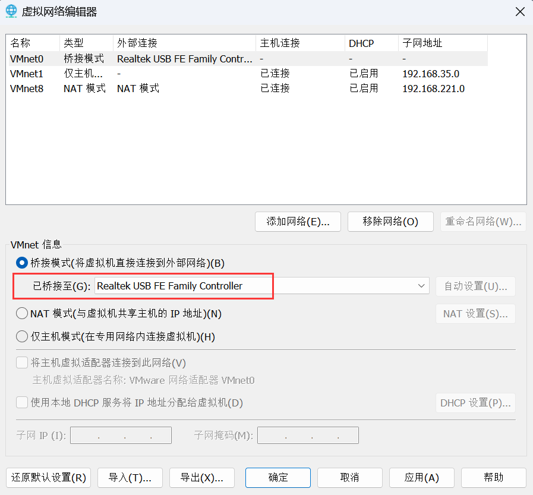
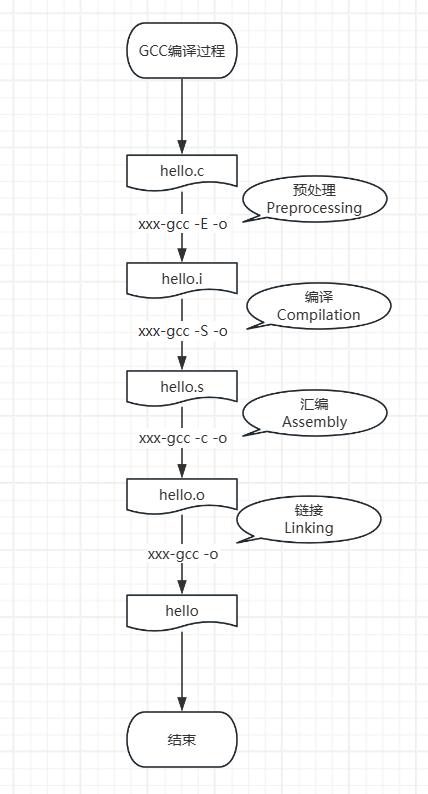

# 【第2篇】安装虚拟机/Ubuntu基本操作

## 【P5】2_3_shell命令解析与PATH环境变量

```shell
# 进行磁盘操作
fdisk /dev/sda
# 退出磁盘操作
q

# 输出环境变量路径
echo $PATH
# 输出所有的环境变量
env

cd /home/book/Desktop
gcc -o hello hello.c
# 需要使用相对路径或绝对路径。不带路径的话，默认会从$PATH路径下找
hello # Command 'hello' not found...
./hello # Hello, world!
./hello vectorx # Hello, vectorx!
/home/book/Desktop/hello test #Hello, test!
# 不想带路径，可以随意移动到一个环境变量所在的路径下
sudo cp hello /usr/local/bin/hello2
hello2 # Hello, world!

# 1、临时设置环境变量
cp hello /home/book
export PATH=$PATH:/home/book
hello # Hello, world!

# 2、永久设置环境变量（对当前用户有效）
gedit ~/.bashrc
# 页尾添加
export PATH=$PATH:/home/book
hello # Hello, world!

# 3、永久设置环境变量（对所有用户有效）
sudo gedit /etc/environment
# 在PATH的值尾部添加
:/home/book
hello # Hello, world!

for((i=0;i<10;i++));do hello $i;done 
# Hello, 0!
# Hello, 1!
# Hello, 2!
# Hello, 3!
# Hello, 4!
# Hello, 5!
# Hello, 6!
# Hello, 7!
# Hello, 8!
# Hello, 9!
```

## 【P6】2_4_目录与文件操作命令

```bash
cd - # 切换到上一个目录

ls -a # 列出所有文件（包括隐藏文件）
```

## 【P7】2_5_权限与属性命令

```bash
# 1、augo分别表示所有人(all)、用户(user)、组(group)、其他用户(other)
# 2、+表示添加权限，-表示移除权限
# 3、r读，w写，x可执行
# 示例：
# 所有用户添加写权限
sudo chmod a+w hello
# 拥有者移除执行权限
sudo chmod u-x hello

# 改变文件的所有者
sudo chown root:root hello
```

## 【P8】2_6_find和grep命令

```bash
# 带通配符
find . -name "*.txt"

# 递归查找当前目录下包含"abc"整词内容的所有文件并显示行号
# *: 当前目录下所有文件
# -r: 递归查找所有子目录下的文件
# -n: 显示行号
# -w: 整词匹配
grep "abc" * -nwr
```

## 【P9】2_7_压缩和解压缩命令

```bash
# 创建一个1MB空内容的“test”文件
# 从“/dev/zero”设备读取数据，并将这些数据写入名为“test”的文件中
# bs=1024: 每次读取和写入的块大小为1024字节
# count=1024: 总共读取和写入1024个块
# 因此最终的文件大小为1024 * 1024 = 1048576 字节（或者约为1MB）
dd if=/dev/zero of=test bs=1024 count=1024

# 验证
ls -l test*

# 删除文件
rm test

# gzip 压缩
# -k: 保留原文件
gzip -k test
# gzip 解压
gzip -dk test.gz

# bzip2 压缩（压缩率更高）
bzip2 -k test
# bzip2 解压
bzip2 -dk test.bz2

# tar 压缩（更通用）
# -c(create)：表示创建用来生成文件包 。
# -x：表示提取，从文件包中提取文件。
# -t：可以查看压缩的文件。
# -z：使用 gzip 方式进行处理，它与”c“结合就表示压缩，与”x“结合就表示解压缩。
# -j：使用 bzip2 方式进行处理，它与”c“结合就表示压缩，与”x“结合就表示解压缩。
# -v(verbose)：详细报告 tar 处理的信息。
# -f(file)：表示文件，后面接着一个文件名。 -C <指定目录> 解压到指定目录。
tar czf test.tar.gz test
tar cjf test.tar.bz2 test
tar xzf test.tar.gz
tar xjf test.tar.bz2
```

## 【P11】2\_9\_VI编辑器\_新建\_保存\_浏览

```bash
# 显示行号
:set number
# 隐藏行号
:set nonumber
# 跳转至100行
:100

# 向前翻页
ctrl + f
# 向后翻页
ctrl + b
```

## 【P12】2_10_VI编辑器_编辑

```bash
# 删除光标处字符 
x
# 撤销操作
u

# 删除单词
dw
# 删除光标后所有内容 
D
# 删除n行
ndd
```

## 【P13】2_11_VI编辑器_复制粘贴查找替换

```bash
# 复制整行
yy
# 复制n行
nyy
# 粘贴到下一行
p

# 查找
/pattern
# 上一个匹配
N
# 下一个匹配
n

# 替换
:%s/p1/p2/g
# 替换（待确认）
:%s/p1/p2/gc
```


# 【第3篇】环境搭建与开发板操作(IMX6ULL_Pro)

## 【P15】3_2_配置VMware使用双网卡之NAT网卡

管理 > 虚拟机设置


网络适配器 > NAT 模式


VMnet8 网络适配器


主要应该是下面两个服务

- VMware DHCP Service
  - DHCP（Dynamic host configuration protocol，动态主机配置协议）
- VMware NAT Service


## 【P16】3\_03-1\_配置VMware使用双网之桥接网卡(USB网卡)\_IMX6ULL\_Pro


### :one: VMware添加桥接网卡


### :two: VMnet选择网卡

以管理员身份运行【虚拟网络编辑器】


VMnet0，已桥接至“Realtek USB FE Family Controller”



### :three: VMware设置IP

Settings > Network


IPv4 

- IPv4 Method: `Manual`
- Address: `192.168.5.11`
- Netmask: `255.255.255.0`
- Cateway: `192.168.5.1`


### :four: 开发板设置 IP

```bash
# 设置IP
ifconfig eth0 192.168.5.9
# 验证
ifconfig

# 修改开发板/etc/network/目录下的 interfaces 文件
vi /etc/network/interfaces
auto lo
iface lo inet loopback
auto eth0
iface eth0 inet static
    address 192.168.5.9
    netmask 255.255.255.0
    gateway 192.168.5.1
# 验证   
cat /etc/network/interfaces

# 重启网络服务
/etc/init.d/S40network restart
```

### :five: 三者互 ping

```bash
# windows
ping 192.168.5.11
ping 192.168.5.9

# ubuntu
ping 192.168.5.10
ping 192.168.5.9

# 开发板
ping 192.168.5.11
ping 192.168.5.10
```


## 【P20】3\_5\_安装软件\_远程登录\_传文件

```bash
# 一键配置/初始化开发环境(其实就是安装 tftp，nfs，vim 等软件，此脚本只支持 Ubuntu-16.04 /Ubuntu-18.04)
git clone https://e.coding.net/weidongshan/DevelopmentEnvConf.git
cd DevelopmentEnvConf
sudo ./Configuring_ubuntu.sh
```

`hello.c`

```c
#include <stdio.h>
int main(int argc, char **argv)
{
	printf("hello, world!\n");
	return 0;
}
```

编译运行

```bash
gcc -o hello hello.c
./hello
```

## 【P21】3\_06-1\_下载BSP\_配置工具链\_IMX6ULL\_Pro

BSP（Board Support Package，板级支持包），可支持操作系统更好地运行于硬件主板

### :one: 下载 BSP

```bash
# 1、配置repo
git config --global user.email "vectorxxx@foxmail.com"
git config --global user.name "vectorx"

# 2、下载 BSP
git clone https://e.coding.net/codebug8/repo.git
mkdir -p 100ask_imx6ull-sdk && cd 100ask_imx6ull-sdk
# 初始化repo
../repo/repo init -u https://gitee.com/weidongshan/manifests.git -b linux-sdk -m imx6ull/100ask_imx6ull_linux4.9.88_release.xml --no-repo-verify
# 下载源码
../repo/repo sync -j4
```

### :two: 配置工具链

```bash
vi ~/.bashrc
export ARCH=arm
export CROSS_COMPILE=arm-buildroot-linux-gnueabihf-
export PATH=$PATH:/home/book/100ask_imx6ull-sdk/ToolChain/arm-buildroot-linux-gnueabihf_sdk-buildroot/bin

# 重新进入SSH
# 验证
arm-buildroot-linux-gnueabihf-gcc -v
```

## 【P23】3\_07-1\_传输源码并创建sourceinsight工程\_IMX6ULL\_Pro

```bash
cd /home/book/100ask_imx6ull-sdk
tar cjf Linux-4.9.88.tar.bz2 Linux-4.9.88/
```

打开 SourceInsight

[Options] > [File Type Options] > [C/C++ Source File]

- File filter: 添加 `;*.s`


[Project] > [New Project]

- New porject name: `Linux-4.9.88`
- Where do you want to store the project data files? `D:\workspace-mine\28-Linux\Linux-4.9.88`


[Add All]

- [x] Include top level sub-directories
- [x] Recursively add lower sub-directories


确定


[Project] > [Sychronize Files]

Database Updates

- [x] Force all files to be re-parsed


> 同步文件即解析源码，生成函数，生成变量的数据库的过程

## 【P25】3\_08-1\_启动方式与连接串口\_IMX6ULL\_Pro

连接到主机后，查看设备管理器

- 端口（COM 和 LPT）
  - USB-Enhanced-SERIAL CH9102


使用串口工具 MobaXterm

- Speed(bps): 115200
- Flow control: None


Enter 键后输入密码 root 即可

## 【P27】3\_09-1\_开发板挂载Ubuntu的NFS目录\_IMX6ULL\_Pro

Ubuntu 下操作

```bash
# 1、查看是否开放权限
cat /etc/exports
# 存在此提示，说明已开放，可以给任意用户使用
# /home/book/  *(rw,nohide,insecure,no_subtree_check,async,no_root_squash)

# 2、查看是否启动 nfs 服务
ps -A | grep nfs

# 3、mount 挂载
# -t nfs：t(type), 指定要挂载的文件系统类型是NFS
# -o nolock：o(optional), 指定挂载选项，这里表示不使用文件锁定机制
# -o vers=3：指定NFS协议的版本为3
# 192.168.233.128:/home/book/nfs_rootfs/：这是远程NFS服务器的IP地址和共享目录的路径（其中192.168.233.128 为 Ubuntu 的 NAT 网卡 IP，根据实际情况修改）
# /mnt：这是本地目录，远程共享目录会被挂载到这个位置。
sudo mount -t nfs -o nolock,vers=3 192.168.233.128:/home/book/nfs_rootfs/ /mnt
# 验证挂载目录是否一致
echo 123 > /home/book/nfs_rootfs/1.txt
ls /home/book/nfs_rootfs/ /mnt

```

开发板串口下操作

```bash
# mount 挂载
sudo mount -t nfs -o nolock,vers=3 192.168.56.11:/home/book/nfs_rootfs/ /mnt
ls /mnt
cat /mnt/1.txt
```

进一步测试验证挂载效果

```bash
# Ubuntu 下操作
cd /home/book/nfs_rootfs/
vi 2.txt
hello

# 开发板串口下操作
cd /mnt
ls
cat 2.txt
vi 3.txt
test

# Ubuntu 下操作
cd /home/book/nfs_rootfs/

cat 3.txt
```

## 【P29】3\_10\_开发板的第1个APP


```bash
# Ubuntu 下操作
# 上传文件：01_all_series_quickstart\04_嵌入式Linux应用开发基础知识\source\01_hello
cd /home/book/nfs_rootfs/01_hello
# 编译
gcc -o hello hello.c
# 执行
./hello
./hello vectorx

# 开发板下操作
./hello
-bash: ./hello: cannot execute binary file: Exec format error
```

上述的并不能直接在开发板中执行，因为需要使用交叉编译工具链（不同的板子工具链前缀可能不一样，但是原理一样）

```bash
# Ubuntu 下操作
arm-buildroot-linux-gnueabihf-gcc -o hello hello.c
# 开发板下操作
./hello
```

## 【P30】3\_11-1\_编译替换内核\_设备树\_驱动\_IMX6ULL\_Pro

ubuntu 下操作

```bash
cd /home/book/100ask_imx6ull-sdk/Linux-4.9.88

# make 是一个常用的构建工具，用于在Linux系统中编译和构建软件。在这里，它被用来构建内核映像(zImage)

# ++++++0、清理++++++
# 清理Linux内核源代码目录中的所有生成文件和配置，将其恢复到一个干净的状态，以便重新编译或进行其他操作
# ①清除所有已生成的内核二进制文件（例如.zImage、vmlinuz等）
# ②删除所有已生成的内核模块和对象文件
# ③清除所有生成的临时文件和构建日志
# ④删除配置文件和内核的编译时设置
make mrproper
# ++++++1、配置++++++
# 100ask_imx6ull_defconfig是针对i.MX6ULL处理器的一个特定配置文件，用于配置Linux内核以适配该处理器和相应的开发板。执行该命令将会根据该特定配置文件生成一个默认的配置，包含了适用于i.MX6ULL处理器的默认编译选项和配置参数
make 100ask_imx6ull_defconfig
# ++++++2、编译内核++++++
# zImage 是Linux内核的一种压缩格式，通常用于引导可引导的Linux内核
# -j4 是一个make命令的选项，用来指定并行编译的任务数。在这里，-j4表示同时运行4个编译任务，加快构建过程的速度，特别是在多核系统上。可以根据电脑的CPU核心数量来调整该值，一般建议设置为CPU核心数加1
make zImage -j4
# ++++++3、编译设备树++++++
# 编译设备树源文件（Device Tree Source，DTS）并生成设备树二进制文件（Device Tree Blob，DTB）
# 设备树文件描述了硬件设备在系统中的布局和配置信息
make dtbs

# 将编译好的Linux内核zImage和设备树文件（DTB）复制到一个目录（nfs_rootfs）中，通常用于准备嵌入式系统的根文件系统，Bootloader能够加载这些文件并正确配置Linux内核和硬件设备，这样系统能够顺利启动并正常运行
# 拷贝内核
cp arch/arm/boot/zImage ~/nfs_rootfs
# 拷贝设备树
cp arch/arm/boot/dts/100ask_imx6ull-14x14.dtb ~/nfs_rootfs

# ++++++4、编译内核模块++++++
make modules
# ++++++5、安装内核模块到某个目录下备用++++++
make ARCH=arm INSTALL_MOD_PATH=/home/book/nfs_rootfs modules_install

cd ~/nfs_rootfs/
```

开发板串口下操作

```bash
# 查看内核版本
uname -a

# 挂载目录
mount -t nfs -o nolock,vers=3 192.168.5.11:/home/book/nfs_rootfs/ /mnt

# 安装内核模块到开发板
cp /mnt/zImage /boot
cp /mnt/100ask_imx6ull-14x14.dtb /boot
# -r（recursion，递归）：复制目录及目录内的所有文件和子目录
# -f（force，强制）：如果目标文件已经存在，则覆盖它，而不提示用户进行确认
# -d（directory，目录）：对目录进行复制操作，创建一个新的目录
cp /mnt/lib/modules /lib -rfd

# 同步，将上述操作过程中的内存内容强制刷新到FLASH上
sync

# 重启开发板
reboot
```

## 【P32】3\_12\_开发板的第1个驱动

ubuntu 下操作

```bash
# 指定开发板内核源码路径
cd ~/nfs_rootfs/01_hello_drv/
vi Makefile
# 替换 KERN_DIR 路径为：
/home/book/100ask_imx6ull-sdk/Linux-4.9.88

# 构建编译内核
make
```

开发板串口下操作

```bash
# 挂载目录
mount -t nfs -o nolock,vers=3 192.168.5.11:/home/book/nfs_rootfs/ /mnt

# 装载驱动程序
cd /mnt/01_hello_drv/
insmod hello_drv.ko

# 查看设备节点
ls /dev/hello

# 显示当前系统中已注册的设备列表
# /proc 是一个特殊的虚拟文件系统，用于访问系统内核的运行时信息
# /proc/devices 文件列出了当前系统所支持的所有设备及其对应的主设备号和次设备号
# 通过查看/proc/devices文件，可以了解系统中支持的设备类型和数量，以及设备对应的主次设备号码。在Linux系统中，设备的主设备号码用于区分设备类型，次设备号码用于标识具体的设备实例
cat /proc/devices

# 显示当前系统加载的内核模块
# 内核模块是一种用于扩展内核功能的二进制文件，可以添加新的驱动程序、文件系统或其他功能到操作系统内核中
# lsmod 会列出已经加载到内核中的所有模块的信息，包括模块的名称、大小、使用次数以及依赖关系等
lsmod


# 执行测试程序
# 写入一个字符串
./hello_drv_test -w www.100ask.net
# 读取字符串
./hello_drv_test -r
```

## 【P33】3\_13-1\_使用Buildroot编译整套系统\_IMX6ULL\_Pro

6 构建 bootloader、内核、文件系统

6.5 构建 IMX6ULL Pro 版的根文件系统

6.5.2 编译系统

```bash
cd /home/book/100ask_imx6ull-sdk/Buildroot_2020.02.x
# 清理
make clean
# 配置
make 100ask_imx6ull_pro_ddr512m_systemV_qt5_defconfig
# 编译需要很长时间，同时需要科学上网
make all -j4
```

6.5.3 镜像文件

```bash
# 查看编译结果
ls output/images/
```


或者通过 `tree` 命令查看树形结构

```bash
tree -L 2 output/images/
output/images
├── 100ask_imx6ull-14x14.dtb
├── 100ask_imx6ull_mini.dtb
├── 100ask-imx6ull-pro-512d-systemv-v1.img
├── 100ask_myir_imx6ull_mini.dtb
├── bootfs.ext4
├── rootfs.cpio
├── rootfs.cpio.gz
├── rootfs.cpio.uboot
├── rootfs.ext2
├── rootfs.ext4 -> rootfs.ext2
├── rootfs.tar
├── rootfs.tar.bz2
├── u-boot-dtb.imx
└── zImage
```

## 【P35】3\_14-1\_烧写系统\_IMX6ULL\_Pro

开发板串口下操作

```bash
uname -a

md5sum /boot/zImage
# b855159c7aff915154251069cea7638a  /boot/zImage
```

ubuntu 下操作

```bash
md5sum zImage
# b855159c7aff915154251069cea7638a  zImage
```

使用 buildroot 编译出来的系统既支持 LVGL，也支持 QT

如果想使用 QT，可以按如下步骤在开发板串口下操作

```bash
cd /etc/init.d/

ls
# S01syslogd  S09modload  S40network          S50mosquitto   S80dnsmasq   rcK
# S02klogd    S10udev     S44modem-manager    S50pulseaudio  S98swupdate  rcS
# S02sysctl   S20urandom  S45network-manager  S50sshd        S99myirhmi2
# S05lvgl     S30dbus     S49ntp              S50telnet      bluetooth
```

其中，

- `S05lvgl` 是 `LVGL` 的启动文件
- `S99myirhmi2` 是 `QT` 的启动文件

接着，将 `LVGL` 的启动文件即 `S05lvgl` 移出去（没有 `LVGL` 文件就会默认使用 `QT` 的）

```bash
mv S05lvgl ../

# 重启系统
reboot
```


# 【第4篇】嵌入式Linux应用开发基础知识

## 【P39】4_2-1GCC编译过程



## 【P40】4_2-2GCC常用选项

```bash
# -v：verbose，详细信息
gcc -c -o main.o main.c -v
```

### 1、一起编译、链接

```bash
# 多文件组成应用程序
gcc -o test main.c sub.c
./test
```


### 2、分开编译、链接

```bash
# 如果文件很多的情况下，只是修改其中一部分文件，重新编译就会很低效
# 采用如下命令就不用对所有文件都进行一遍编译过程了，只对修改的文件重新编译，而且文件越多越高效
gcc -c -o main.o main.c
gcc -c -o sub.o  sub.c
gcc -o test main.o sub.o
```

### 3、指定头文件目录

修改 `main.c`

```c
// #include "sub.h"
#include <sub.h>
```

重新编译

```bash
# -I：优先在指定的头文件目录中查找.h文件
gcc -c -o main.o main.c -I ./
```

> Q：为什么是-I？
>
> A：I应该是 include 的简写

### 4、静态库

```bash
gcc -c -o sub.o  sub.c

# ar(ARchiver): 是一个用于创建、修改和提取静态库的命令行工具
# c(Create): 创建一个新的归档文件。如果指定的归档文件已存在，将会被覆盖。
# r(Replace): 向归档文件中插入文件。如果归档文件已经存在，r 参数会将文件添加到归档中，而不删除已经存在的文件。如果你想替换已存在的目标文件，可以使用 ru 选项。
# s(Symbol): 创建一个索引表。这个索引表可以加快链接的过程，尤其是在包含多个目标文件的情况下。
ar crs libsub.a sub.o

gcc -o test main.o libsub.a
```

### 5、动态库

```bash
gcc -c -o sub.o  sub.c

# -shared: 这个选项告诉 GCC 生成一个共享库，而不是一个传统的可执行文件。共享库是可以被多个程序共享使用的库文件，它们在运行时被链接。
gcc -shared -o libsub.so sub.o

gcc -o test2 main.o libsub.so
# 或
gcc -o test2 main.o -L ./ -l sub
```

> Q：为什么是-L和-l？
>
> A：L、l 应该都是 Library 的简写，一个用来指定目录，一个用来指定文件

```bash
# 通过 file 命令查看文件属性信息
file test
```

<details><summary><font size="3" color="orange">输出</font></summary> 
<pre><code class="language-json">test: ELF 64-bit LSB shared object, x86-64, version 1 (SYSV), dynamically linked, interpreter /lib64/ld-linux-x86-64.so.2, for GNU/Linux 3.2.0, BuildID[sha1]=6773267e8306146b0ed0a6fde929016ceef0df8c, not stripped</code></pre></details>

```bash
file test2
```

<details><summary><font size="3" color="orange">输出</font></summary> 
<pre><code class="language-json">test2: ELF 64-bit LSB shared object, x86-64, version 1 (SYSV), dynamically linked, interpreter /lib64/ld-linux-x86-64.so.2, for GNU/Linux 3.2.0, BuildID[sha1]=5fc8e492f903d49e80e769ff124fd626886c3614, not stripped</code></pre></details>

> Q：可以看到 test 和 test2 文件都是动态链接文件（dynamically linked），这是为什么呢？？？test明明是通过静态库链接的啊！！！
>
> A：
>
> - test:链接了静态库 `libsub.a`，但是其他库是动态链接的
> - test2：链接了动态库 `libsub.so`，其他库也是动态链接的

```bash
./test2
```

<details><summary><font size="3" color="orange">输出</font></summary> 
<pre><code class="language-json">./test2: error while loading shared libraries: libsub.so: cannot open shared object file: No such file or directory</code></pre></details>

> Q：为什么[通过动态库链接生成的文件]无法像[通过静态库链接生成的文件]一样正常运行呢？
>
> A：因为静态库无需指定库的位置，但动态库链接时指定了动态库，因此动态库链接生成的文件运行时也要指定对应的路径

==解决上述问题==

```bash
export LD_LIBRARY_PATH=$LD_LIBRARY_PATH:./

# 再来执行
./test2
```

<details><summary><font size="3" color="orange">输出</font></summary> 
<pre><code class="language-json">Main fun!
Sub fun!</code></pre></details>

### 6、其他

```bash
# 列出头文件目录、库文件目录
echo 'main(){}' | gcc -E -v -
```

<details><summary><font size="3" color="orange">输出</font></summary> 
<pre><code class="language-json">Using built-in specs.
COLLECT_GCC=gcc
OFFLOAD_TARGET_NAMES=nvptx-none
OFFLOAD_TARGET_DEFAULT=1
Target: x86_64-linux-gnu
Configured with: ../src/configure -v --with-pkgversion='Ubuntu 7.5.0-3ubuntu1~18.04' --with-bugurl=file:///usr/share/doc/gcc-7/README.Bugs --enable-languages=c,ada,c++,go,brig,d,fortran,objc,obj-c++ --prefix=/usr --with-gcc-major-version-only --program-suffix=-7 --program-prefix=x86_64-linux-gnu- --enable-shared --enable-linker-build-id --libexecdir=/usr/lib --without-included-gettext --enable-threads=posix --libdir=/usr/lib --enable-nls --enable-bootstrap --enable-clocale=gnu --enable-libstdcxx-debug --enable-libstdcxx-time=yes --with-default-libstdcxx-abi=new --enable-gnu-unique-object --disable-vtable-verify --enable-libmpx --enable-plugin --enable-default-pie --with-system-zlib --with-target-system-zlib --enable-objc-gc=auto --enable-multiarch --disable-werror --with-arch-32=i686 --with-abi=m64 --with-multilib-list=m32,m64,mx32 --enable-multilib --with-tune=generic --enable-offload-targets=nvptx-none --without-cuda-driver --enable-checking=release --build=x86_64-linux-gnu --host=x86_64-linux-gnu --target=x86_64-linux-gnu
Thread model: posix
gcc version 7.5.0 (Ubuntu 7.5.0-3ubuntu1~18.04)
COLLECT_GCC_OPTIONS='-E' '-v' '-mtune=generic' '-march=x86-64'
 /usr/lib/gcc/x86_64-linux-gnu/7/cc1 -E -quiet -v -imultiarch x86_64-linux-gnu - -mtune=generic -march=x86-64 -fstack-protector-strong -Wformat -Wformat-security
ignoring nonexistent directory "/usr/local/include/x86_64-linux-gnu"
ignoring nonexistent directory "/usr/lib/gcc/x86_64-linux-gnu/7/../../../../x86_64-linux-gnu/include"
#include "..." search starts here:
#include <...> search starts here:
 /usr/lib/gcc/x86_64-linux-gnu/7/include
 /usr/local/include
 /usr/lib/gcc/x86_64-linux-gnu/7/include-fixed
 /usr/include/x86_64-linux-gnu
 /usr/include
End of search list.
# 1 "<stdin>"
# 1 "<built-in>"
# 1 "<command-line>"
# 31 "<command-line>"
# 1 "/usr/include/stdc-predef.h" 1 3 4
# 32 "<command-line>" 2
# 1 "<stdin>"
main(){}
COMPILER_PATH=/usr/lib/gcc/x86_64-linux-gnu/7/:/usr/lib/gcc/x86_64-linux-gnu/7/:/usr/lib/gcc/x86_64-linux-gnu/:/usr/lib/gcc/x86_64-linux-gnu/7/:/usr/lib/gcc/x86_64-linux-gnu/
LIBRARY_PATH=/usr/lib/gcc/x86_64-linux-gnu/7/:/usr/lib/gcc/x86_64-linux-gnu/7/../../../x86_64-linux-gnu/:/usr/lib/gcc/x86_64-linux-gnu/7/../../../../lib/:/lib/x86_64-linux-gnu/:/lib/../lib/:/usr/lib/x86_64-linux-gnu/:/usr/lib/../lib/:/usr/lib/gcc/x86_64-linux-gnu/7/../../../:/lib/:/usr/lib/
COLLECT_GCC_OPTIONS='-E' '-v' '-mtune=generic' '-march=x86-64'</code></pre></details>

同样适用于 **交叉编译工具链**

```bash
echo 'main(){}' | arm-linux-gcc -E -v -
```

<details><summary><font size="3" color="orange">输出</font></summary> 
<pre><code class="language-json">Using built-in specs.
COLLECT_GCC=/home/book/100ask_imx6ull-sdk/ToolChain/arm-buildroot-linux-gnueabihf_sdk-buildroot/bin/arm-linux-gcc.br_real
Target: arm-buildroot-linux-gnueabihf
Configured with: ./configure --prefix=/home/book/100ask_imx6ull-sdk/Buildroot_2020.02.x/output/host --sysconfdir=/home/book/100ask_imx6ull-sdk/Buildroot_2020.02.x/output/host/etc --enable-static --target=arm-buildroot-linux-gnueabihf --with-sysroot=/home/book/100ask_imx6ull-sdk/Buildroot_2020.02.x/output/host/arm-buildroot-linux-gnueabihf/sysroot --enable-__cxa_atexit --with-gnu-ld --disable-libssp --disable-multilib --disable-decimal-float --with-gmp=/home/book/100ask_imx6ull-sdk/Buildroot_2020.02.x/output/host --with-mpc=/home/book/100ask_imx6ull-sdk/Buildroot_2020.02.x/output/host --with-mpfr=/home/book/100ask_imx6ull-sdk/Buildroot_2020.02.x/output/host --with-pkgversion='Buildroot 2020.02-gee85cab' --with-bugurl=http://bugs.buildroot.net/ --disable-libquadmath --enable-tls --enable-plugins --enable-lto --enable-threads --with-isl=/home/book/100ask_imx6ull-sdk/Buildroot_2020.02.x/output/host --with-abi=aapcs-linux --with-cpu=cortex-a7 --with-fpu=neon-vfpv4 --with-float=hard --with-mode=arm --enable-languages=c,c++,fortran --with-build-time-tools=/home/book/100ask_imx6ull-sdk/Buildroot_2020.02.x/output/host/arm-buildroot-linux-gnueabihf/bin --enable-shared --enable-libgomp
Thread model: posix
gcc version 7.5.0 (Buildroot 2020.02-gee85cab)
COLLECT_GCC_OPTIONS='-E' '-v' '-mcpu=cortex-a7' '-mfloat-abi=hard' '-mfpu=neon-vfpv4' '-mabi=aapcs-linux' '-marm' '-mtls-dialect=gnu'
 /home/book/100ask_imx6ull-sdk/ToolChain/arm-buildroot-linux-gnueabihf_sdk-buildroot/bin/../libexec/gcc/arm-buildroot-linux-gnueabihf/7.5.0/cc1 -E -quiet -v -iprefix /home/book/100ask_imx6ull-sdk/ToolChain/arm-buildroot-linux-gnueabihf_sdk-buildroot/bin/../lib/gcc/arm-buildroot-linux-gnueabihf/7.5.0/ -isysroot /home/book/100ask_imx6ull-sdk/ToolChain/arm-buildroot-linux-gnueabihf_sdk-buildroot/arm-buildroot-linux-gnueabihf/sysroot - -mcpu=cortex-a7 -mfloat-abi=hard -mfpu=neon-vfpv4 -mabi=aapcs-linux -marm -mtls-dialect=gnu
ignoring duplicate directory "/home/book/100ask_imx6ull-sdk/ToolChain/arm-buildroot-linux-gnueabihf_sdk-buildroot/bin/../lib/gcc/../../lib/gcc/arm-buildroot-linux-gnueabihf/7.5.0/include"
ignoring nonexistent directory "/home/book/100ask_imx6ull-sdk/ToolChain/arm-buildroot-linux-gnueabihf_sdk-buildroot/arm-buildroot-linux-gnueabihf/sysroot/usr/local/include"
ignoring duplicate directory "/home/book/100ask_imx6ull-sdk/ToolChain/arm-buildroot-linux-gnueabihf_sdk-buildroot/bin/../lib/gcc/../../lib/gcc/arm-buildroot-linux-gnueabihf/7.5.0/include-fixed"
ignoring duplicate directory "/home/book/100ask_imx6ull-sdk/ToolChain/arm-buildroot-linux-gnueabihf_sdk-buildroot/bin/../lib/gcc/../../lib/gcc/arm-buildroot-linux-gnueabihf/7.5.0/../../../../arm-buildroot-linux-gnueabihf/include"
#include "..." search starts here:
#include <...> search starts here:
 /home/book/100ask_imx6ull-sdk/ToolChain/arm-buildroot-linux-gnueabihf_sdk-buildroot/bin/../lib/gcc/arm-buildroot-linux-gnueabihf/7.5.0/include
 /home/book/100ask_imx6ull-sdk/ToolChain/arm-buildroot-linux-gnueabihf_sdk-buildroot/bin/../lib/gcc/arm-buildroot-linux-gnueabihf/7.5.0/include-fixed
 /home/book/100ask_imx6ull-sdk/ToolChain/arm-buildroot-linux-gnueabihf_sdk-buildroot/bin/../lib/gcc/arm-buildroot-linux-gnueabihf/7.5.0/../../../../arm-buildroot-linux-gnueabihf/include
 /home/book/100ask_imx6ull-sdk/ToolChain/arm-buildroot-linux-gnueabihf_sdk-buildroot/arm-buildroot-linux-gnueabihf/sysroot/usr/include
End of search list.
# 1 "<stdin>"
# 1 "<built-in>"
# 1 "<command-line>"
# 31 "<command-line>"
# 1 "/home/book/100ask_imx6ull-sdk/ToolChain/arm-buildroot-linux-gnueabihf_sdk-buildroot/arm-buildroot-linux-gnueabihf/sysroot/usr/include/stdc-predef.h" 1 3 4
# 32 "<command-line>" 2
# 1 "<stdin>"
main(){}
COMPILER_PATH=/home/book/100ask_imx6ull-sdk/ToolChain/arm-buildroot-linux-gnueabihf_sdk-buildroot/bin/../libexec/gcc/arm-buildroot-linux-gnueabihf/7.5.0/:/home/book/100ask_imx6ull-sdk/ToolChain/arm-buildroot-linux-gnueabihf_sdk-buildroot/bin/../libexec/gcc/:/home/book/100ask_imx6ull-sdk/ToolChain/arm-buildroot-linux-gnueabihf_sdk-buildroot/bin/../lib/gcc/arm-buildroot-linux-gnueabihf/7.5.0/../../../../arm-buildroot-linux-gnueabihf/bin/
LIBRARY_PATH=/home/book/100ask_imx6ull-sdk/ToolChain/arm-buildroot-linux-gnueabihf_sdk-buildroot/bin/../lib/gcc/arm-buildroot-linux-gnueabihf/7.5.0/:/home/book/100ask_imx6ull-sdk/ToolChain/arm-buildroot-linux-gnueabihf_sdk-buildroot/bin/../lib/gcc/:/home/book/100ask_imx6ull-sdk/ToolChain/arm-buildroot-linux-gnueabihf_sdk-buildroot/bin/../lib/gcc/arm-buildroot-linux-gnueabihf/7.5.0/../../../../arm-buildroot-linux-gnueabihf/lib/:/home/book/100ask_imx6ull-sdk/ToolChain/arm-buildroot-linux-gnueabihf_sdk-buildroot/arm-buildroot-linux-gnueabihf/sysroot/lib/:/home/book/100ask_imx6ull-sdk/ToolChain/arm-buildroot-linux-gnueabihf_sdk-buildroot/arm-buildroot-linux-gnueabihf/sysroot/usr/lib/
COLLECT_GCC_OPTIONS='-E' '-v' '-mcpu=cortex-a7' '-mfloat-abi=hard' '-mfpu=neon-vfpv4' '-mabi=aapcs-linux' '-marm' '-mtls-dialect=gnu'</code></pre></details>

```bash
# 展开所有宏
gcc -E -dM main.c > 1.txt
```

<details><summary><font size="3" color="orange">1.txt</font></summary> 
<pre><code class="language-json">#define _IO_CURRENTLY_PUTTING 0x800
#define __SSP_STRONG__ 3
#define __DBL_MIN_EXP__ (-1021)
#define _IO_peekc_unlocked(_fp) (_IO_BE ((_fp)->_IO_read_ptr >= (_fp)->_IO_read_end, 0) && __underflow (_fp) == EOF ? EOF : *(unsigned char *) (_fp)->_IO_read_ptr)
#define __FLT32X_MAX_EXP__ 1024
#define __UINT_LEAST16_MAX__ 0xffff
#define __ATOMIC_ACQUIRE 2
#define __FLT128_MAX_10_EXP__ 4932
#define __FLT_MIN__ 1.17549435082228750796873653722224568e-38F
#define __GCC_IEC_559_COMPLEX 2
#define __GLIBC_USE(F) __GLIBC_USE_ ## F
#define __UINT_LEAST8_TYPE__ unsigned char
#define __SIZEOF_FLOAT80__ 16
#define __flexarr []
#define _IO_FLAGS2_USER_WBUF 8
#define __S64_TYPE long int
#define __stub_fchflags 
#define __SQUAD_TYPE long int
#define __INTMAX_C(c) c ## L
#define _BSD_SIZE_T_DEFINED_ 
#define __TIME_T_TYPE __SYSCALL_SLONG_TYPE
#define __CHAR_BIT__ 8
#define __FSWORD_T_TYPE __SYSCALL_SLONG_TYPE
#define _G_HAVE_MREMAP 1
#define _BITS_LIBIO_H 1
#define __UINT8_MAX__ 0xff
#define __WINT_MAX__ 0xffffffffU
#define __FLT32_MIN_EXP__ (-125)
#define stderr stderr
#define __GLIBC_PREREQ(maj,min) ((__GLIBC__ << 16) + __GLIBC_MINOR__ >= ((maj) << 16) + (min))
#define __OFF_T_MATCHES_OFF64_T 1
#define __ORDER_LITTLE_ENDIAN__ 1234
#define __SIZE_MAX__ 0xffffffffffffffffUL
#define __stub_putmsg 
#define __WCHAR_MAX__ 0x7fffffff
#define __BLKCNT_T_TYPE __SYSCALL_SLONG_TYPE
#define __GCC_HAVE_SYNC_COMPARE_AND_SWAP_1 1
#define __GCC_HAVE_SYNC_COMPARE_AND_SWAP_2 1
#define __GCC_HAVE_SYNC_COMPARE_AND_SWAP_4 1
#define __DBL_DENORM_MIN__ ((double)4.94065645841246544176568792868221372e-324L)
#define __GCC_HAVE_SYNC_COMPARE_AND_SWAP_8 1
#define __GCC_ATOMIC_CHAR_LOCK_FREE 2
#define __GCC_IEC_559 2
#define _IO_flockfile(_fp) 
#define __FLT32X_DECIMAL_DIG__ 17
#define _IOFBF 0
#define __FLT_EVAL_METHOD__ 0
#define _IO_USER_LOCK 0x8000
#define _IO_NO_WRITES 8
#define __ASMNAME2(prefix,cname) __STRING (prefix) cname
#define __unix__ 1
#define __FLT64_DECIMAL_DIG__ 17
#define _G_HAVE_ST_BLKSIZE defined (_STATBUF_ST_BLKSIZE)
#define __stub_setlogin 
#define __GCC_ATOMIC_CHAR32_T_LOCK_FREE 2
#define __SYSCALL_WORDSIZE 64
#define __x86_64 1
#define __attribute_nonstring__ 
#define __UINT_FAST64_MAX__ 0xffffffffffffffffUL
#define __SIG_ATOMIC_TYPE__ int
#define __GID_T_TYPE __U32_TYPE
#define __DBL_MIN_10_EXP__ (-307)
#define __FINITE_MATH_ONLY__ 0
#define __attribute_alloc_size__(params) __attribute__ ((__alloc_size__ params))
#define __GNUC_PATCHLEVEL__ 0
#define __FLT32_HAS_DENORM__ 1
#define _IO_pid_t __pid_t
#define __UINT_FAST8_MAX__ 0xff
#define __LEAF , __leaf__
#define __LDBL_REDIR1(name,proto,alias) name proto
#define __has_include(STR) __has_include__(STR)
#define __size_t 
#define __DEC64_MAX_EXP__ 385
#define __INT8_C(c) c
#define __INT_LEAST8_WIDTH__ 8
#define __UINT_LEAST64_MAX__ 0xffffffffffffffffUL
#define _IO_FLAGS2_MMAP 1
#define __always_inline __inline __attribute__ ((__always_inline__))
#define __SHRT_MAX__ 0x7fff
#define __LDBL_MAX__ 1.18973149535723176502126385303097021e+4932L
#define __FLT64X_MAX_10_EXP__ 4932
#define _IO_need_lock(_fp) (((_fp)->_flags2 & _IO_FLAGS2_NEED_LOCK) != 0)
#define _IOS_BIN 128
#define __fortify_function __extern_always_inline __attribute_artificial__
#define _IO_MAGIC_MASK 0xFFFF0000
#define __UINT_LEAST8_MAX__ 0xff
#define __GCC_ATOMIC_BOOL_LOCK_FREE 2
#define __FLT128_DENORM_MIN__ 6.47517511943802511092443895822764655e-4966F128
#define __UINTMAX_TYPE__ long unsigned int
#define __linux 1
#define __DEC32_EPSILON__ 1E-6DF
#define __FLT_EVAL_METHOD_TS_18661_3__ 0
#define _BITS_TYPES_H 1
#define _IO_cleanup_region_end(_Doit) 
#define _IO_DONT_CLOSE 0100000
#define __unix 1
#define __UINT32_MAX__ 0xffffffffU
#define __UID_T_TYPE __U32_TYPE
#define getc(_fp) _IO_getc (_fp)
#define __SIZE_T 
#define __LDBL_MAX_EXP__ 16384
#define _ATFILE_SOURCE 1
#define _IO_ssize_t __ssize_t
#define __FLT128_MIN_EXP__ (-16381)
#define __WINT_MIN__ 0U
#define __linux__ 1
#define _IOS_OUTPUT 2
#define __FLT128_MIN_10_EXP__ (-4931)
#define __INT_LEAST16_WIDTH__ 16
#define _SIZE_T_DEFINED_ 
#define __LDBL_REDIR_NTH(name,proto) name proto __THROW
#define __SCHAR_MAX__ 0x7f
#define __FLT128_MANT_DIG__ 113
#define _IO_UNIFIED_JUMPTABLES 1
#define __WCHAR_MIN__ (-__WCHAR_MAX__ - 1)
#define __KERNEL_STRICT_NAMES 
#define _IO_stderr ((_IO_FILE*)(&_IO_2_1_stderr_))
#define _IO_ferror_unlocked(__fp) (((__fp)->_flags & _IO_ERR_SEEN) != 0)
#define __INT64_C(c) c ## L
#define __NTH(fct) __attribute__ ((__nothrow__ __LEAF)) fct
#define __DBL_DIG__ 15
#define __GCC_ATOMIC_POINTER_LOCK_FREE 2
#define __FLT64X_MANT_DIG__ 64
#define __GLIBC_USE_IEC_60559_TYPES_EXT 0
#define _POSIX_SOURCE 1
#define __SIZEOF_INT__ 4
#define __SIZEOF_POINTER__ 8
#define _DEFAULT_SOURCE 1
#define __attribute_used__ __attribute__ ((__used__))
#define _STDIO_USES_IOSTREAM 
#define _IO_IN_BACKUP 0x100
#define __USER_LABEL_PREFIX__ 
#define __glibc_macro_warning(message) __glibc_macro_warning1 (GCC warning message)
#define __GLIBC__ 2
#define __END_DECLS 
#define __FLT64X_EPSILON__ 1.08420217248550443400745280086994171e-19F64x
#define __CONCAT(x,y) x ## y
#define __STDC_HOSTED__ 1
#define __LDBL_HAS_INFINITY__ 1
#define __SLONG32_TYPE int
#define _IO_LINE_BUF 0x200
#define _IOS_NOCREATE 32
#define __GNU_LIBRARY__ 6
#define __FLT32_DIG__ 6
#define __RLIM_T_MATCHES_RLIM64_T 1
#define _G_BUFSIZ 8192
#define __FLT_EPSILON__ 1.19209289550781250000000000000000000e-7F
#define _IO_EOF_SEEN 0x10
#define __SHRT_WIDTH__ 16
#define TMP_MAX 238328
#define __SSIZE_T_TYPE __SWORD_TYPE
#define __DEV_T_TYPE __UQUAD_TYPE
#define _IO_SKIPWS 01
#define _IO_SCIENTIFIC 04000
#define __LDBL_MIN__ 3.36210314311209350626267781732175260e-4932L
#define __STDC_UTF_16__ 1
#define __nonnull(params) __attribute__ ((__nonnull__ params))
#define __DEC32_MAX__ 9.999999E96DF
#define __GLIBC_USE_IEC_60559_BFP_EXT 0
#define _IO_SHOWPOS 02000
#define __FLT64X_DENORM_MIN__ 3.64519953188247460252840593361941982e-4951F64x
#define __FLT32X_HAS_INFINITY__ 1
#define __INT32_MAX__ 0x7fffffff
#define __GLIBC_USE_DEPRECATED_GETS 0
#define __INT_WIDTH__ 32
#define __SIZEOF_LONG__ 8
#define _IONBF 2
#define _IO_getc_unlocked(_fp) (_IO_BE ((_fp)->_IO_read_ptr >= (_fp)->_IO_read_end, 0) ? __uflow (_fp) : *(unsigned char *) (_fp)->_IO_read_ptr++)
#define __STDC_IEC_559__ 1
#define __STDC_ISO_10646__ 201706L
#define __UINT16_C(c) c
#define __PTRDIFF_WIDTH__ 64
#define _IO_PENDING_OUTPUT_COUNT(_fp) ((_fp)->_IO_write_ptr - (_fp)->_IO_write_base)
#define __DECIMAL_DIG__ 21
#define __NTHNL(fct) __attribute__ ((__nothrow__)) fct
#define __USE_FORTIFY_LEVEL 0
#define __FLT64_EPSILON__ 2.22044604925031308084726333618164062e-16F64
#define __gnu_linux__ 1
#define __INTMAX_WIDTH__ 64
#define __attribute_warn_unused_result__ __attribute__ ((__warn_unused_result__))
#define __has_include_next(STR) __has_include_next__(STR)
#define _IO_LEFT 02
#define __FLT64X_MIN_10_EXP__ (-4931)
#define __LDBL_HAS_QUIET_NAN__ 1
#define __USE_ISOC11 1
#define __FLT64_MANT_DIG__ 53
#define __attribute_const__ __attribute__ ((__const__))
#define __THROW __attribute__ ((__nothrow__ __LEAF))
#define L_tmpnam 20
#define __GNUC__ 7
#define __SYSCALL_ULONG_TYPE __ULONGWORD_TYPE
#define __pie__ 2
#define __MMX__ 1
#define L_ctermid 9
#define __OFF64_T_TYPE __SQUAD_TYPE
#define __FLT_HAS_DENORM__ 1
#define __SIZEOF_LONG_DOUBLE__ 16
#define __LDBL_REDIR1_NTH(name,proto,alias) name proto __THROW
#define SEEK_CUR 1
#define __BIGGEST_ALIGNMENT__ 16
#define __FLT64_MAX_10_EXP__ 308
#define __GLIBC_USE_LIB_EXT2 0
#define __USE_ISOC95 1
#define __USE_ISOC99 1
#define __ASMNAME(cname) __ASMNAME2 (__USER_LABEL_PREFIX__, cname)
#define _IO_uid_t __uid_t
#define __DBL_MAX__ ((double)1.79769313486231570814527423731704357e+308L)
#define __INT_FAST32_MAX__ 0x7fffffffffffffffL
#define __DBL_HAS_INFINITY__ 1
#define __GLIBC_USE_IEC_60559_FUNCS_EXT 0
#define stdin stdin
#define __USE_XOPEN2K 1
#define __DEC32_MIN_EXP__ (-94)
#define __DADDR_T_TYPE __S32_TYPE
#define __INTPTR_WIDTH__ 64
#define _IO_UNITBUF 020000
#define __FD_SETSIZE 1024
#define __attribute_format_strfmon__(a,b) __attribute__ ((__format__ (__strfmon__, a, b)))
#define _IO_MAGIC 0xFBAD0000
#define __FLT32X_HAS_DENORM__ 1
#define __INT_FAST16_TYPE__ long int
#define _SIZE_T_DEFINED 
#define __USE_POSIX199506 1
#define _FEATURES_H 1
#define __LDBL_HAS_DENORM__ 1
#define __stub_getmsg 
#define _IO_FIXED 010000
#define __stub_fattach 
#define __FLT128_HAS_INFINITY__ 1
#define __DEC128_MAX__ 9.999999999999999999999999999999999E6144DL
#define __INT_LEAST32_MAX__ 0x7fffffff
#define _IO_UNBUFFERED 2
#define _IO_INTERNAL 010
#define __DEC32_MIN__ 1E-95DF
#define __S32_TYPE int
#define __glibc_unlikely(cond) __builtin_expect ((cond), 0)
#define __DBL_MAX_EXP__ 1024
#define __WCHAR_WIDTH__ 32
#define __FLT32_MAX__ 3.40282346638528859811704183484516925e+38F32
#define __DEC128_EPSILON__ 1E-33DL
#define __SSE2_MATH__ 1
#define __ATOMIC_HLE_RELEASE 131072
#define __FSFILCNT_T_TYPE __SYSCALL_ULONG_TYPE
#define __PTRDIFF_MAX__ 0x7fffffffffffffffL
#define __CPU_MASK_TYPE __SYSCALL_ULONG_TYPE
#define __amd64 1
#define _IO_LINKED 0x80
#define _IO_HAVE_ST_BLKSIZE _G_HAVE_ST_BLKSIZE
#define __STDC_NO_THREADS__ 1
#define __USECONDS_T_TYPE __U32_TYPE
#define _IO_DELETE_DONT_CLOSE 0x40
#define __OFF_T_TYPE __SYSCALL_SLONG_TYPE
#define __ATOMIC_HLE_ACQUIRE 65536
#define __FLT32_HAS_QUIET_NAN__ 1
#define __LONG_LONG_MAX__ 0x7fffffffffffffffLL
#define __SIZEOF_SIZE_T__ 8
#define __FLT64X_MIN_EXP__ (-16381)
#define __SIZEOF_WINT_T__ 4
#define __LONG_LONG_WIDTH__ 64
#define __U16_TYPE unsigned short int
#define _STDIO_H 1
#define __FLT32_MAX_EXP__ 128
#define __GCC_HAVE_DWARF2_CFI_ASM 1
#define __GXX_ABI_VERSION 1011
#define __FLT_MIN_EXP__ (-125)
#define __glibc_clang_has_extension(ext) 0
#define __extern_always_inline extern __always_inline __attribute__ ((__gnu_inline__))
#define __HAVE_GENERIC_SELECTION 1
#define __FLT64X_HAS_QUIET_NAN__ 1
#define __INT_FAST64_TYPE__ long int
#define __FLT64_DENORM_MIN__ 4.94065645841246544176568792868221372e-324F64
#define __DBL_MIN__ ((double)2.22507385850720138309023271733240406e-308L)
#define _BITS_STDIO_LIM_H 1
#define __PIE__ 2
#define __REDIRECT(name,proto,alias) name proto __asm__ (__ASMNAME (#alias))
#define __LP64__ 1
#define _IO_off64_t __off64_t
#define __FLT32X_EPSILON__ 2.22044604925031308084726333618164062e-16F32x
#define __MODE_T_TYPE __U32_TYPE
#define __LEAF_ATTR __attribute__ ((__leaf__))
#define __DECIMAL_BID_FORMAT__ 1
#define __FLT64_MIN_EXP__ (-1021)
#define __RLIM64_T_TYPE __UQUAD_TYPE
#define _IOS_ATEND 4
#define _IO_BOOLALPHA 0200000
#define __FLT64_MIN_10_EXP__ (-307)
#define __FLT64X_DECIMAL_DIG__ 21
#define __DEC128_MIN__ 1E-6143DL
#define __REGISTER_PREFIX__ 
#define __UINT16_MAX__ 0xffff
#define _IOS_NOREPLACE 64
#define __DBL_HAS_DENORM__ 1
#define _IO_TIED_PUT_GET 0x400
#define __USE_POSIX2 1
#define __FLT32_MIN__ 1.17549435082228750796873653722224568e-38F32
#define __UINT8_TYPE__ unsigned char
#define __SLONGWORD_TYPE long int
#define __REDIRECT_LDBL(name,proto,alias) __REDIRECT (name, proto, alias)
#define __NO_INLINE__ 1
#define __warndecl(name,msg) extern void name (void) __attribute__((__warning__ (msg)))
#define __FLT_MANT_DIG__ 24
#define __LDBL_DECIMAL_DIG__ 21
#define __VERSION__ "7.5.0"
#define __UINT64_C(c) c ## UL
#define _SYS_CDEFS_H 1
#define _STDC_PREDEF_H 1
#define _IO_file_flags _flags
#define __USE_XOPEN2K8 1
#define __STRING(x) #x
#define __GCC_ATOMIC_INT_LOCK_FREE 2
#define __FLT128_MAX_EXP__ 16384
#define __INO_T_TYPE __SYSCALL_ULONG_TYPE
#define _BITS_G_CONFIG_H 1
#define __ssize_t_defined 
#define __GNUC_PREREQ(maj,min) ((__GNUC__ << 16) + __GNUC_MINOR__ >= ((maj) << 16) + (min))
#define __FLT32_MANT_DIG__ 24
#define _SYS_SIZE_T_H 
#define __FLOAT_WORD_ORDER__ __ORDER_LITTLE_ENDIAN__
#define __FSBLKCNT64_T_TYPE __UQUAD_TYPE
#define _IO_feof_unlocked(__fp) (((__fp)->_flags & _IO_EOF_SEEN) != 0)
#define __SUSECONDS_T_TYPE __SYSCALL_SLONG_TYPE
#define __SIZE_T__ 
#define __stub_gtty 
#define __NLINK_T_TYPE __SYSCALL_ULONG_TYPE
#define __attribute_deprecated_msg__(msg) __attribute__ ((__deprecated__ (msg)))
#define _IO_SHOWPOINT 0400
#define __stub_sstk 
#define __glibc_macro_warning1(message) _Pragma (#message)
#define __wur 
#define __STDC_IEC_559_COMPLEX__ 1
#define _G_HAVE_MMAP 1
#define __FLT128_HAS_DENORM__ 1
#define __FLT128_DIG__ 33
#define __SCHAR_WIDTH__ 8
#define __INT32_C(c) c
#define __DEC64_EPSILON__ 1E-15DD
#define __ORDER_PDP_ENDIAN__ 3412
#define __DEC128_MIN_EXP__ (-6142)
#define __FLT32_MAX_10_EXP__ 38
#define __INT_FAST32_TYPE__ long int
#define _BITS_TYPESIZES_H 1
#define __SYSCALL_SLONG_TYPE __SLONGWORD_TYPE
#define __UINT_LEAST16_TYPE__ short unsigned int
#define __FLT64X_HAS_INFINITY__ 1
#define unix 1
#define __INT16_MAX__ 0x7fff
#define __THROWNL __attribute__ ((__nothrow__))
#define _BSD_SIZE_T_ 
#define __SIZE_TYPE__ long unsigned int
#define __UINT64_MAX__ 0xffffffffffffffffUL
#define __va_arg_pack_len() __builtin_va_arg_pack_len ()
#define __ULONGWORD_TYPE unsigned long int
#define _SIZE_T_DECLARED 
#define __FLT64X_DIG__ 18
#define _IO_SHOWBASE 0200
#define __INT8_TYPE__ signed char
#define __ELF__ 1
#define __GCC_ASM_FLAG_OUTPUTS__ 1
#define __ID_T_TYPE __U32_TYPE
#define __warnattr(msg) __attribute__((__warning__ (msg)))
#define _IO_funlockfile(_fp) 
#define __FLT_RADIX__ 2
#define __INT_LEAST16_TYPE__ short int
#define __LDBL_EPSILON__ 1.08420217248550443400745280086994171e-19L
#define __UINTMAX_C(c) c ## UL
#define _POSIX_C_SOURCE 200809L
#define _G_IO_IO_FILE_VERSION 0x20001
#define __SSE_MATH__ 1
#define __k8 1
#define __LDBL_REDIR(name,proto) name proto
#define __SIG_ATOMIC_MAX__ 0x7fffffff
#define __GCC_ATOMIC_WCHAR_T_LOCK_FREE 2
#define _IO_IS_FILEBUF 0x2000
#define __SIZEOF_PTRDIFF_T__ 8
#define SEEK_SET 0
#define _IO_FLAGS2_NOTCANCEL 2
#define __stub_sigreturn 
#define __errordecl(name,msg) extern void name (void) __attribute__((__error__ (msg)))
#define __FLT32X_MANT_DIG__ 53
#define __restrict_arr __restrict
#define __attribute_artificial__ __attribute__ ((__artificial__))
#define __USE_MISC 1
#define __UWORD_TYPE unsigned long int
#define __x86_64__ 1
#define _SIZE_T_ 
#define __FLT32X_MIN_EXP__ (-1021)
#define __DEC32_SUBNORMAL_MIN__ 0.000001E-95DF
#define _IO_iconv_t _G_iconv_t
#define _IO_USER_BUF 1
#define __INT_FAST16_MAX__ 0x7fffffffffffffffL
#define __stub_revoke 
#define _IO_off_t __off_t
#define __FLT64_DIG__ 15
#define __UINT_FAST32_MAX__ 0xffffffffffffffffUL
#define __UINT_LEAST64_TYPE__ long unsigned int
#define __U64_TYPE unsigned long int
#define __FLT_HAS_QUIET_NAN__ 1
#define __FLT_MAX_10_EXP__ 38
#define __glibc_c99_flexarr_available 1
#define __LONG_MAX__ 0x7fffffffffffffffL
#define __FLT64X_HAS_DENORM__ 1
#define __DEC128_SUBNORMAL_MIN__ 0.000000000000000000000000000000001E-6143DL
#define __FLT_HAS_INFINITY__ 1
#define __UINT_FAST16_TYPE__ long unsigned int
#define __bos0(ptr) __builtin_object_size (ptr, 0)
#define __DEC64_MAX__ 9.999999999999999E384DD
#define __INT_FAST32_WIDTH__ 64
#define NULL ((void *)0)
#define __CHAR16_TYPE__ short unsigned int
#define __PRAGMA_REDEFINE_EXTNAME 1
#define _VA_LIST_DEFINED 
#define __SIZE_WIDTH__ 64
#define __BLKSIZE_T_TYPE __SYSCALL_SLONG_TYPE
#define __SEG_FS 1
#define _IO_size_t size_t
#define __INT_LEAST16_MAX__ 0x7fff
#define __stub_lchmod 
#define __DEC64_MANT_DIG__ 16
#define __INT64_MAX__ 0x7fffffffffffffffL
#define __UINT_LEAST32_MAX__ 0xffffffffU
#define __SEG_GS 1
#define __FLT32_DENORM_MIN__ 1.40129846432481707092372958328991613e-45F32
#define __GCC_ATOMIC_LONG_LOCK_FREE 2
#define __SIG_ATOMIC_WIDTH__ 32
#define __INT_LEAST64_TYPE__ long int
#define __INT16_TYPE__ short int
#define __INT_LEAST8_TYPE__ signed char
#define __STDC_VERSION__ 201112L
#define __DEC32_MAX_EXP__ 97
#define __INT_FAST8_MAX__ 0x7f
#define __PMT(args) args
#define __FLT128_MAX__ 1.18973149535723176508575932662800702e+4932F128
#define __INTPTR_MAX__ 0x7fffffffffffffffL
#define _OLD_STDIO_MAGIC 0xFABC0000
#define linux 1
#define _IOS_APPEND 8
#define __FLT64_HAS_QUIET_NAN__ 1
#define ____FILE_defined 1
#define _IOLBF 1
#define _IO_UPPERCASE 01000
#define __FLT32_MIN_10_EXP__ (-37)
#define __SSE2__ 1
#define __KEY_T_TYPE __S32_TYPE
#define __FLT32X_DIG__ 15
#define __WORDSIZE 64
#define __BEGIN_DECLS 
#define __LDBL_MANT_DIG__ 64
#define __DBL_HAS_QUIET_NAN__ 1
#define _IO_BAD_SEEN 0x4000
#define __FLT64_HAS_INFINITY__ 1
#define __FLT64X_MAX__ 1.18973149535723176502126385303097021e+4932F64x
#define __GNUC_VA_LIST 
#define __SIG_ATOMIC_MIN__ (-__SIG_ATOMIC_MAX__ - 1)
#define __code_model_small__ 1
#define __RLIM_T_TYPE __SYSCALL_ULONG_TYPE
#define FILENAME_MAX 4096
#define __k8__ 1
#define __INTPTR_TYPE__ long int
#define __UINT16_TYPE__ short unsigned int
#define __WCHAR_TYPE__ int
#define __CLOCKID_T_TYPE __S32_TYPE
#define __SIZEOF_FLOAT__ 4
#define _IOS_TRUNC 16
#define __HAVE_COLUMN 
#define __stub_fdetach 
#define __pic__ 2
#define __UINTPTR_MAX__ 0xffffffffffffffffUL
#define __INT_FAST64_WIDTH__ 64
#define __DEC64_MIN_EXP__ (-382)
#define __stub_chflags 
#define putc(_ch,_fp) _IO_putc (_ch, _fp)
#define __UQUAD_TYPE unsigned long int
#define __FLT32_DECIMAL_DIG__ 9
#define __USE_POSIX 1
#define __INT_FAST64_MAX__ 0x7fffffffffffffffL
#define __GCC_ATOMIC_TEST_AND_SET_TRUEVAL 1
#define BUFSIZ _IO_BUFSIZ
#define __FLT_DIG__ 6
#define __FSID_T_TYPE struct { int __val[2]; }
#define __FLT32_HAS_INFINITY__ 1
#define __FLT64X_MAX_EXP__ 16384
#define __UINT_FAST64_TYPE__ long unsigned int
#define _IO_putc_unlocked(_ch,_fp) (_IO_BE ((_fp)->_IO_write_ptr >= (_fp)->_IO_write_end, 0) ? __overflow (_fp, (unsigned char) (_ch)) : (unsigned char) (*(_fp)->_IO_write_ptr++ = (_ch)))
#define __LDBL_REDIR_DECL(name) 
#define __INT_MAX__ 0x7fffffff
#define __amd64__ 1
#define __S16_TYPE short int
#define __bos(ptr) __builtin_object_size (ptr, __USE_FORTIFY_LEVEL > 1)
#define _T_SIZE_ 
#define _G_va_list __gnuc_va_list
#define _IOS_INPUT 1
#define __INT64_TYPE__ long int
#define __FLT_MAX_EXP__ 128
#define __ORDER_BIG_ENDIAN__ 4321
#define __ptr_t void *
#define __DBL_MANT_DIG__ 53
#define ___int_size_t_h 
#define __TIMER_T_TYPE void *
#define __SIZEOF_FLOAT128__ 16
#define __INT_LEAST64_MAX__ 0x7fffffffffffffffL
#define __GCC_ATOMIC_CHAR16_T_LOCK_FREE 2
#define __GLIBC_MINOR__ 27
#define __DEC64_MIN__ 1E-383DD
#define __WINT_TYPE__ unsigned int
#define __UINT_LEAST32_TYPE__ unsigned int
#define __SIZEOF_SHORT__ 2
#define __SSE__ 1
#define __LDBL_MIN_EXP__ (-16381)
#define _IO_va_list __gnuc_va_list
#define __FLT64_MAX__ 1.79769313486231570814527423731704357e+308F64
#define stdout stdout
#define __WINT_WIDTH__ 32
#define __REDIRECT_NTHNL(name,proto,alias) name proto __asm__ (__ASMNAME (#alias)) __THROWNL
#define EOF (-1)
#define __INT_LEAST8_MAX__ 0x7f
#define __extern_inline extern __inline __attribute__ ((__gnu_inline__))
#define __USE_POSIX199309 1
#define __FLT32X_MAX_10_EXP__ 308
#define ____mbstate_t_defined 1
#define __SIZEOF_INT128__ 16
#define __BLKCNT64_T_TYPE __SQUAD_TYPE
#define __LDBL_MAX_10_EXP__ 4932
#define __ATOMIC_RELAXED 0
#define __FSBLKCNT_T_TYPE __SYSCALL_ULONG_TYPE
#define __DBL_EPSILON__ ((double)2.22044604925031308084726333618164062e-16L)
#define __stub_stty 
#define __FLT128_MIN__ 3.36210314311209350626267781732175260e-4932F128
#define _SIZET_ 
#define _LP64 1
#define __REDIRECT_NTH_LDBL(name,proto,alias) __REDIRECT_NTH (name, proto, alias)
#define __UINT8_C(c) c
#define __FLT64_MAX_EXP__ 1024
#define __INT_LEAST32_TYPE__ int
#define SEEK_END 2
#define __SIZEOF_WCHAR_T__ 4
#define __USE_POSIX_IMPLICITLY 1
#define __UINT64_TYPE__ long unsigned int
#define __REDIRECT_NTH(name,proto,alias) name proto __asm__ (__ASMNAME (#alias)) __THROW
#define _IO_RIGHT 04
#define __stub___compat_bdflush 
#define __FLT128_HAS_QUIET_NAN__ 1
#define __INT_FAST8_TYPE__ signed char
#define __PID_T_TYPE __S32_TYPE
#define __FLT64X_MIN__ 3.36210314311209350626267781732175260e-4932F64x
#define __GNUC_STDC_INLINE__ 1
#define P_tmpdir "/tmp"
#define __attribute_pure__ __attribute__ ((__pure__))
#define __FLT64_HAS_DENORM__ 1
#define __WORDSIZE_TIME64_COMPAT32 1
#define __FLT32_EPSILON__ 1.19209289550781250000000000000000000e-7F32
#define _IO_stdin ((_IO_FILE*)(&_IO_2_1_stdin_))
#define _IO_cleanup_region_start(_fct,_fp) 
#define _IO_NO_READS 4
#define _IO_DEC 020
#define __DBL_DECIMAL_DIG__ 17
#define __STDC_UTF_32__ 1
#define __INT_FAST8_WIDTH__ 8
#define __FXSR__ 1
#define __DEC_EVAL_METHOD__ 2
#define _SIZE_T 
#define _IO_ERR_SEEN 0x20
#define __FLT32X_MAX__ 1.79769313486231570814527423731704357e+308F32x
#define __ULONG32_TYPE unsigned int
#define _IO_OCT 040
#define FOPEN_MAX 16
#define _IO_STDIO 040000
#define __off_t_defined 
#define _IO_IS_APPENDING 0x1000
#define _GCC_SIZE_T 
#define __INO64_T_TYPE __UQUAD_TYPE
#define __UINT32_C(c) c ## U
#define __INTMAX_MAX__ 0x7fffffffffffffffL
#define __BYTE_ORDER__ __ORDER_LITTLE_ENDIAN__
#define __size_t__ 
#define _IO_BUFSIZ _G_BUFSIZ
#define __FLT_DENORM_MIN__ 1.40129846432481707092372958328991613e-45F
#define __INT8_MAX__ 0x7f
#define __LONG_WIDTH__ 64
#define __PIC__ 2
#define __UINT_FAST32_TYPE__ long unsigned int
#define __INO_T_MATCHES_INO64_T 1
#define _IO_fpos_t _G_fpos_t
#define __CHAR32_TYPE__ unsigned int
#define __FLT_MAX__ 3.40282346638528859811704183484516925e+38F
#define __attribute_format_arg__(x) __attribute__ ((__format_arg__ (x)))
#define __INT32_TYPE__ int
#define __SIZEOF_DOUBLE__ 8
#define __FLT_MIN_10_EXP__ (-37)
#define __FLT64_MIN__ 2.22507385850720138309023271733240406e-308F64
#define _IO_BE(expr,res) __builtin_expect ((expr), res)
#define __INT_LEAST32_WIDTH__ 32
#define __SWORD_TYPE long int
#define __INTMAX_TYPE__ long int
#define __DEC128_MAX_EXP__ 6145
#define _T_SIZE 
#define __va_arg_pack() __builtin_va_arg_pack ()
#define __FLT32X_HAS_QUIET_NAN__ 1
#define __ATOMIC_CONSUME 1
#define _IO_stdout ((_IO_FILE*)(&_IO_2_1_stdout_))
#define __GNUC_MINOR__ 5
#define __INT_FAST16_WIDTH__ 64
#define __UINTMAX_MAX__ 0xffffffffffffffffUL
#define __DEC32_MANT_DIG__ 7
#define __FLT32X_DENORM_MIN__ 4.94065645841246544176568792868221372e-324F32x
#define __glibc_clang_prereq(maj,min) 0
#define __DBL_MAX_10_EXP__ 308
#define __FILE_defined 1
#define __LDBL_DENORM_MIN__ 3.64519953188247460252840593361941982e-4951L
#define __INT16_C(c) c
#define __U32_TYPE unsigned int
#define __STDC__ 1
#define __attribute_malloc__ __attribute__ ((__malloc__))
#define __PTRDIFF_TYPE__ long int
#define __attribute_noinline__ __attribute__ ((__noinline__))
#define _IO_HEX 0100
#define __ATOMIC_SEQ_CST 5
#define __CLOCK_T_TYPE __SYSCALL_SLONG_TYPE
#define _IO_fpos64_t _G_fpos64_t
#define __UINT32_TYPE__ unsigned int
#define __FLT32X_MIN_10_EXP__ (-307)
#define __UINTPTR_TYPE__ long unsigned int
#define __DEC64_SUBNORMAL_MIN__ 0.000000000000001E-383DD
#define __FSFILCNT64_T_TYPE __UQUAD_TYPE
#define __DEC128_MANT_DIG__ 34
#define __LDBL_MIN_10_EXP__ (-4931)
#define __attribute_deprecated__ __attribute__ ((__deprecated__))
#define __FLT128_EPSILON__ 1.92592994438723585305597794258492732e-34F128
#define _IO_wint_t wint_t
#define __SIZEOF_LONG_LONG__ 8
#define __USE_ATFILE 1
#define __FLT128_DECIMAL_DIG__ 36
#define __GCC_ATOMIC_LLONG_LOCK_FREE 2
#define __FLT32X_MIN__ 2.22507385850720138309023271733240406e-308F32x
#define __LDBL_DIG__ 18
#define __FLT_DECIMAL_DIG__ 9
#define __UINT_FAST16_MAX__ 0xffffffffffffffffUL
#define __GCC_ATOMIC_SHORT_LOCK_FREE 2
#define __INT_LEAST64_WIDTH__ 64
#define _IO_ftrylockfile(_fp) 
#define __glibc_likely(cond) __builtin_expect ((cond), 1)
#define __UINT_FAST8_TYPE__ unsigned char
#define __P(args) args
#define __ATOMIC_ACQ_REL 4
#define __ATOMIC_RELEASE 3
#define _IO_peekc(_fp) _IO_peekc_unlocked (_fp)</code></pre></details>

```bash
# 生成依赖文件 abc.dep，后面 Makefile 会用
gcc -Wp,-MD,abc.dep -c -o main.o main.c

cat abc.dep
```

<details><summary><font size="3" color="orange">abc.dep</font></summary> 
<pre><code class="language-json">main.o: main.c /usr/include/stdc-predef.h /usr/include/stdio.h \
 /usr/include/x86_64-linux-gnu/bits/libc-header-start.h \
 /usr/include/features.h /usr/include/x86_64-linux-gnu/sys/cdefs.h \
 /usr/include/x86_64-linux-gnu/bits/wordsize.h \
 /usr/include/x86_64-linux-gnu/bits/long-double.h \
 /usr/include/x86_64-linux-gnu/gnu/stubs.h \
 /usr/include/x86_64-linux-gnu/gnu/stubs-64.h \
 /usr/lib/gcc/x86_64-linux-gnu/7/include/stddef.h \
 /usr/include/x86_64-linux-gnu/bits/types.h \
 /usr/include/x86_64-linux-gnu/bits/typesizes.h \
 /usr/include/x86_64-linux-gnu/bits/types/__FILE.h \
 /usr/include/x86_64-linux-gnu/bits/types/FILE.h \
 /usr/include/x86_64-linux-gnu/bits/libio.h \
 /usr/include/x86_64-linux-gnu/bits/_G_config.h \
 /usr/include/x86_64-linux-gnu/bits/types/__mbstate_t.h \
 /usr/lib/gcc/x86_64-linux-gnu/7/include/stdarg.h \
 /usr/include/x86_64-linux-gnu/bits/stdio_lim.h \
 /usr/include/x86_64-linux-gnu/bits/sys_errlist.h sub.h</code></pre></details>

## 【P42】4_3-2Makefile的引入及规则

`Makefile`

```makefile
test: a.o b.o
	gcc -o test a.o b.o

a.o: a.c
	gcc -c -o a.o a.c

b.o: b.c
	gcc -c -o b.o b.c
```

任意修改 a.c 和 b.c

```bash
# 通过 Makefile 重新构建
make
```

## 【P43】4_3-3Makefile的语法

### 1、通配符

> Q：如果文件上百上千，难道 Makefile 要写上百上千行？
>
> A：不需要，通配符应运而生了

`Makefile`

```makefile
test: a.o b.o c.o
	gcc -o test $^

%.o: %.c
	gcc -c -o $@ $<
```

- `$@`: 目标文件
- `$<`: 首个依赖文件
- `$^`: 所有依赖文件

```bash
make
```

### 2、clean

`Makefile`

```makefile
test: a.o b.o c.o
	gcc -o test $^

%.o: %.c
	gcc -c -o $@ $<
	
clean:
	rm *.o test
```

执行 clean 命令

```bash
make clean
```

如果当前目录下不存在 clean 文件，是能够正常执行的

如果当前目录存在 clean 文件，则无法正常执行

```bash
make clean
# make: 'clean' is up to date.
```

> Q：为什么无法正常执行呢？如何解决？
>
> A：.PHONY 应运而生了

### 3、伪目标.PHONY

`Makefile`

```makefile
test: a.o b.o c.o
	gcc -o test $^

%.o: %.c
	gcc -c -o $@ $<
	
clean:
	rm *.o test
	
.PHONY: clean	
```

存在 `.PHONY` 指令，就不会判断 clean 文件是否存在了，因此能够保证正常执行

```bash
make clean
# rm *.o test
```

### 4、变量

```makefile
# 即时变量
A := xxx	# 定义即确定
# 延时变量
B = xxx		# 使用才确定
C ?= xxx	# 首次定义生效，否则忽略
# 附加变量
D += xxx	# 变量性质取决于前面的定义
```

`Makefile`

```makefile
A := $(C)
B = $(C)
C = abc

D = funnyboy
D ?= vectorx

E ?= hah

all:
        @echo A = $(A)
        @echo B = $(B)
        @echo C = $(C)
        @echo D = $(D)
		@echo E = $(E)

C = qwe
C += 123
```

```bash
# 编译
make 
# A =
# B = qwe 123
# C = qwe 123
# D = funnyboy
# E = hah
```

另外地

```bash
# make 命令时可以指定变量值
make A=223
# A = 223
# B = qwe 123
# C = qwe 123
# D = funnyboy
# E = hah
```

## 【P44】4_3-4Makefile函数

- `foreach`
- `filter`、`filter-out`
- `wildcard`
- `patsubst`

`Makefile`

```makefile
A = a b c
B = $(foreach f, $(A), $(f).o)

C = a b c d/
D = $(filter %/, $(C))
E = $(filter-out %/, $(C))

files = $(wildcard *.c)

F = a.c b.c c.c d.c e.c abc
files2 = $(wildcard $(F))

files3 = $(patsubst %.c, %.d, $(F))

all:
	@echo B = $(B)
	@echo D = $(D)
	@echo E = $(E)
	@echo files = $(files)
	@echo files2 = $(files2)	
	@echo files3 = $(files3)	
```

```bash
make
# B = a.o b.o c.o
# D = d/
# E = a b c
# files = a.c c.c b.c
# files2 = a.c b.c c.c
# files3 = a.d b.d c.d d.d e.d abc
```

